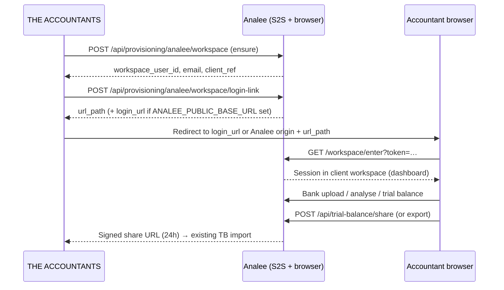

# Analee ↔ THE ACCOUNTANTS integration contract

| Field | Value |
|-------|-------|
| Status | Companion to merged Analee PR #62; orchestration lives in `CNBSSA/accountants` |
| Analee surface | `provisioning.py` (dark S2S + browser entry) |
| Date | 2026-07-16 |
| Audience | `CNBSSA/accountants` engineers |

---

## 1. Product flow

THE ACCOUNTANTS is the **orchestrator**; standalone Analee is the **per-client workspace** for bank-statement analysis and trial-balance production.



**Identity:** THE ACCOUNTANTS owns the mapping from firm **client** → `client_ref`. Analee only derives a deterministic workspace alias from that ref.

**Handoff back:** Trial balance uses the existing Phase 5 transmission API and signed share links (`reports/routes.py`). Accountants already ingests TB by account **link** — keep chart links aligned via `docs/CHART_RECONCILIATION.md`.

---

## 2. Environment (paired deployment)

| Variable | Side | Purpose |
|----------|------|---------|
| `ANALEE_PROVISIONING_ENABLED` | Analee | `True` to expose S2S + `/workspace/enter` (default off = dark) |
| `ANALEE_PROVISIONING_SECRET` | Analee + Accountants | Shared bearer secret; must match on both sides |
| `ANALEE_WORKSPACE_LINK_TTL` | Analee | Seconds for workspace login tokens (default `90`) |
| `ANALEE_PUBLIC_BASE_URL` | Analee | Optional public origin, e.g. `https://analee.example.com` — when set, login-link responses include absolute `login_url` |
| `ANALEE_BASE_URL` | Accountants | Analee origin for S2S calls (ensure + login-link); append `url_path` when `login_url` absent |
| `ANALEE_ENTITLEMENT_ENFORCED` | Analee | When `True`, gates human subscribers/Club; workspace users remain `subscription_status=active` |

**Fail-closed:** If provisioning is disabled or the secret is missing/wrong, Analee returns `404` / `503` / `401` as documented in tests — Accountants should treat those as non-retryable config errors until ops fixes env.

---

## 3. S2S authentication

All provisioning endpoints require:

```http
Authorization: Bearer <ANALEE_PROVISIONING_SECRET>
Content-Type: application/json
```

CSRF does not apply (blueprint is exempt). Use server-side HTTP only — never expose the secret to the browser.

---

## 4. Endpoints

### 4.1 Subscriber entitlement (optional)

`POST /api/provisioning/analee`

Grant or revoke **human** Analee access by email (reuse `subscription_status`, no schema change).

**Body:** `{ "email": "user@firm.com", "entitled": true }` (`entitled` defaults to `true`).

**200:** `{ "found": true|false, "entitled": bool, "subscription_status"?: "active"|"inactive" }`

Use when a firm buys THE ACCOUNTANTS standalone and the human must log into Analee directly (not via client workspace).

### 4.2 Ensure client workspace

`POST /api/provisioning/analee/workspace`

**Body:**

| Field | Required | Notes |
|-------|----------|-------|
| `client_ref` | yes | THE ACCOUNTANTS stable id; sanitised to `[a-z0-9-]` (max 60) |
| `client_name` | recommended | Display name → `CompanySettings.company_name` |
| `entity_name` | optional | Must match Analee `Entity.name` (e.g. `Sole Proprietor`); unknown → Private Company default chart |

**200 example:**

```json
{
  "created": true,
  "client_ref": "acc-7-42",
  "workspace_user_id": 123,
  "email": "client+acc-7-42@ws.theaccountants.local",
  "company": "Mokoena Traders",
  "entity": "Private Company",
  "chart_provisioned": true
}
```

Idempotent: repeat calls reactivate, update `client_name`, return `created: false`. Workspace users have no usable password — entry is **only** via login-link.

### 4.3 Mint workspace login link

`POST /api/provisioning/analee/workspace/login-link`

**Body:** `{ "client_ref": "acc-7-42" }` **or** `{ "email": "client+acc-7-42@ws.theaccountants.local" }`

**200 (found):**

```json
{
  "found": true,
  "client_ref": "acc-7-42",
  "email": "client+acc-7-42@ws.theaccountants.local",
  "url_path": "/workspace/enter?token=…",
  "expires_in": 90,
  "login_url": "https://analee.example.com/workspace/enter?token=…"
}
```

`login_url` is present only when Analee has `ANALEE_PUBLIC_BASE_URL`. Otherwise Accountants builds `ANALEE_BASE_URL + url_path`.

**400** if email is not a workspace alias (prevents magic-login for human accounts).

**200 `{ "found": false }`** if workspace missing, inactive, or deleted.

### 4.4 Browser entry

`GET /workspace/enter?token=…` — accountant lands here; on success sets `session['workspace_session']` and redirects to dashboard. Expired/tampered tokens flash and redirect to login.

---

## 5. Trial balance handoff (unchanged Phase 5)

While logged into the workspace session:

| Method | Path | Auth |
|--------|------|------|
| GET | `/api/trial-balance` | Session |
| GET | `/api/trial-balance/share` | Session → `{ share_url, expires_in_seconds, format }` |
| GET | `/api/trial-balance/shared/<token>` | None (signed token) |

**JSON contract** (`format_version: 1`, `source: "analee"`):

```json
{
  "format_version": 1,
  "source": "analee",
  "company_id": 123,
  "company_name": "Mokoena Traders",
  "registration_number": "",
  "as_at": "2026-02-28",
  "period_start": "2025-03-01",
  "period_end": "2026-02-28",
  "balanced": true,
  "rows": [
    { "link": "ca.810.001", "name": "Bank Cheque Account 1", "amount": 100.0 }
  ]
}
```

Accountants import should key off `rows[].link` (BooksXperts parity links). Share tokens use Analee `SECRET_KEY` (24h default) — separate from provisioning secret.

---

## 6. Suggested Accountants implementation checklist

1. **Config module** — `ANALEE_BASE_URL`, `ANALEE_PROVISIONING_SECRET`, feature flag mirroring Analee dark mode.
2. **HTTP client** — `ensure_workspace(client_ref, client_name, entity_name?)` and `mint_workspace_login(client_ref)`.
3. **Client UI** — “Open in Analee” calls mint, then redirects to `login_url` or composed URL; handle `found: false` with “provision first”.
4. **Store** — persist `client_ref` (your id), optional `workspace_user_id` / workspace `email` from ensure response.
5. **TB import** — reuse existing share-URL or file import; map `company_name` / client display from Accountants client record, not only Analee `company_id`.
6. **Agent tool (optional)** — wrap ensure + login-link for assistant flows; same bearer, no secret in prompts.

---

## 7. Tests (Analee)

| File | Coverage |
|------|----------|
| `tests/test_provisioning.py` | Subscriber activate/deactivate |
| `tests/test_workspace_provisioning.py` | Workspace ensure, login-link, enter, security |
| `tests/test_trial_balance_transmission.py` | TB JSON + share tokens |

Run: `pytest tests/test_provisioning.py tests/test_workspace_provisioning.py tests/test_trial_balance_transmission.py`

---

## 8. Frozen repo note

Analee `AnaleeOriginal` is **re-frozen** after the workspace seam (see `CLAUDE.md`). New orchestration features belong in **`CNBSSA/accountants`**; Analee changes here are limited to the sealed provisioning seam and companion documentation unless Festus scopes another re-open.
